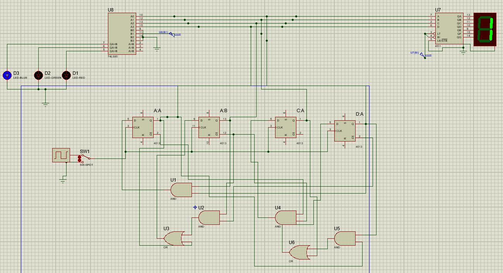

# Digital Circuit Design Project  

This project was developed during my **second year of university** for the **Digital Circuit Design course**. The main goal was to design a synchronous sequential circuit based on specific requirements.  

---

## Problem Description  

The targeted circuit design includes the following specifications:  

1. **Switch Control**:  
   - The circuit operates using a **9V battery**.  
   - It contains two **switches**:  
     - The first switch powers the circuit, triggering a random **counter** that generates numbers between **0 and 9**. These numbers are displayed on a **7-segment display**.  
     - The counter updates **rapidly**, with a display interval of less than **0.5 seconds** for each number.  

2. **Pause Functionality**:  
   - When the second switch is toggled **ON**, the counter stops, and the last displayed value remains static on the **7-segment display**.  

3. **LED Feedback**:  
   - Based on the displayed number and its comparison to the **last digit of the student number (42)**:  
     - **Green LED** lights up if the number matches the last digit (**2**).  
     - **Red LED** lights up if the number is greater.  
     - **Blue LED** lights up if the number is smaller.  

4. **Design Requirements**:  
   - The counter design must be **synchronous** and implemented using **sequential circuit design methods**.  
   - The circuit can be prepared on either **perforated board** or **PCB**.  
   - The entire project, including **circuit simulation**, **calculations**, and **reporting**, must be completed individually.  
   - Design evaluation includes aspects such as:  
     - Circuit functionality.  
     - Simulation results.  
     - Cost analysis.  
     - Component selection.  
     - Report quality.  

---

## Pre-Design Work  
  

---

## Simulation  
Below is a screenshot of the simulation executed in **Proteus**:  
  

---

## Notes  
Due to time constraints, the **PCB design** could not be completed, and therefore, related visuals are not available.  

---
